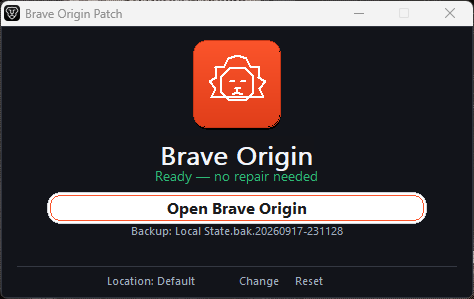

# Brave Origin Patch

  

A small Windows app that checks a Brave Origin community install and repairs its
local settings when they need repair. It makes no network calls and never
changes Brave's own files.

> **Unofficial community utility** — not affiliated with Brave Software. It
> repairs a community local-state shape only and does not provide genuine
> licensing.

## Download v1.2

Grab the single-file app from the
[Releases page](https://github.com/ChathurangaBW/Brave-Origin/releases/latest):

**`BraveOriginPatch.exe`** — no installer, no dependencies, no network. Just run it.

**v1.2:** fixes the **Open Brave Origin** button (proven: Brave window count +1).

## How to use

> **IMPORTANT:** close Brave Origin completely before clicking **Patch** —
> patching while Brave is running will fail with an error.

1. Close Brave Origin first and save any browser work. Then open
   `BraveOriginPatch.exe`.
2. Click **Scan**. This is safe and read-only — it only looks at local settings
   and changes nothing. You will see one of two results:
   - **Ready** — everything is already fine, so there is nothing to do.
   - **Needs repair** — a setting needs attention, so go to step 3.
3. If you see **Needs repair**, click **Patch now**. A timestamped backup is
   saved first. If you click Cancel instead, nothing happens.

## If Brave Origin lives somewhere else

The bar at the bottom of the window shows the folder the app is checking. If you
installed Brave Origin on another drive, click **Change...** and pick the
`BraveSoftware` folder in its new location. Click **Reset** to go back to the
default folder.

## What will happen

- **Scan** only reads local settings. It does not write files, close Brave, or
  start it.
- **Ready** means there is nothing to do — no action is taken.
- **Patch now** saves a timestamped backup before it writes anything.
- Nothing leaves your PC: the app makes no network calls.

## Safety

- **Back up first.** Copy your Brave Origin user-data folder somewhere safe
  before you start.
- This is an **unofficial** community utility. It is **not affiliated with
  Brave Software**.
- It repairs a community local-state shape only and does not provide genuine
  licensing.

## FAQ

**Do I need to run this again after reinstalling Brave Origin?**
Yes. Run Scan again — if the profile was recreated it will say **Needs repair**,
and Patch now will fix it.

**Will a Brave Origin update break this?**
No. Your settings survive updates; run Scan to confirm. If it says **Needs
repair**, click Patch now.

**I just moved to a fresh PC — will it still work?**
Yes. There are no hardcoded usernames, machine IDs, or paths, so the same app
works from any folder.
