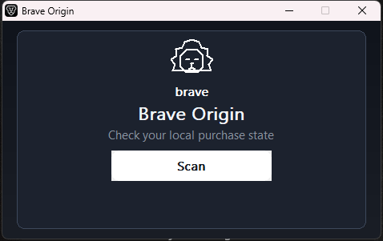
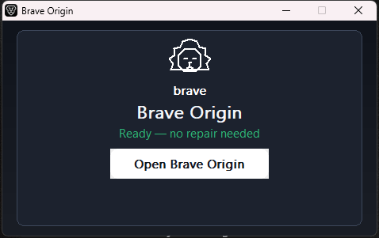

# Brave Origin Mini

A tiny Windows repair app for Brave Origin community builds. It checks local
settings and repairs them when they need repair. It makes no network calls.

> **Unofficial community utility:** not affiliated with Brave Software. It
> repairs a community local-state shape only and does not provide genuine
> licensing.



*The Brave Origin Mini window (472x272).*




## Use

1. Close Brave Origin and save any browser work first.
2. Open `BraveOriginMini.exe` and click **Scan**. **Scan is safe/read-only**:
   it only checks local settings and changes nothing.
3. If a channel says **Needs repair**, select it and click **Patch**. A
   timestamped backup is saved first; choosing Cancel does nothing.

Only scanning changes nothing: Scan does not write files, close Brave
Origin, or start it.

## Works after reinstall / update / fresh install

- **Fresh install (Brave not installed yet):** Scan reports *not installed*
  with guidance and writes nothing.
- **Fresh profile (Brave installed, no markers yet):** Scan says *Needs
  repair*; Patch makes it *Ready*.
- **Brave version update:** when Brave rewrites its file on upgrade, the
  markers survive and Brave's own keys are preserved.
- **Reinstall:** if the profile is deleted and recreated, Scan reports *not
  installed* and the full repair flow works again afterwards.
- **Any user, any PC:** no hardcoded usernames, SIDs, or machine IDs — the
  single portable `.exe` works from any path (including paths with spaces).

A timestamped backup is always saved before anything is written. Full
evidence, per-scenario results, and the honest boundary (what happens if
Brave changes its scheme): **[ASSURANCE.md](ASSURANCE.md)**.

## Build

Requires MSYS2 MinGW64 at `C:\msys64` and PowerShell 5.1+:

```powershell
powershell -NoProfile -ExecutionPolicy Bypass -File .\build.ps1
```

This produces `dist\BraveOriginMini.exe` (single mini target only).

## Files

- `src/mini_gui.cpp` — 472x272 Scan + Patch window.
- `src/engine.cpp` / `src/engine.h` — shared scan, backup, patch, and
  verification engine.
- `resources/app.rc` + `resources/app.manifest` + `resources/brave-lion.ico`
  — manifest, version info, and lion icon.
