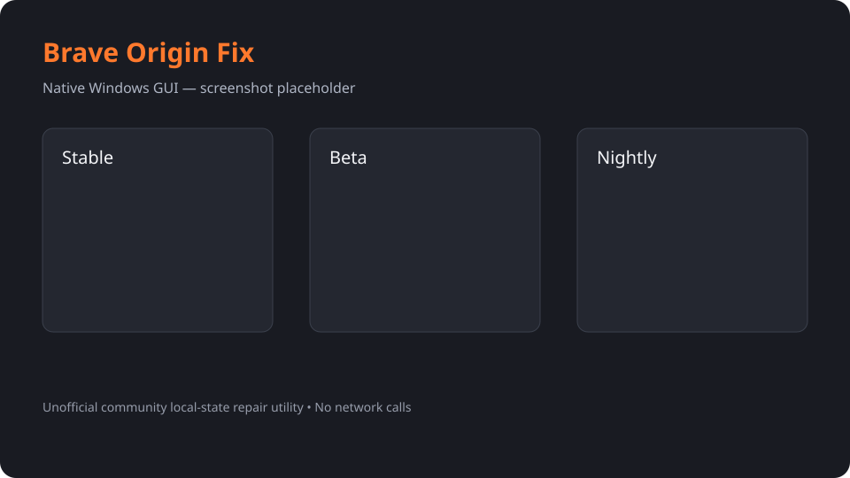

# Brave Origin Fix



A native Windows utility for diagnosing and repairing the **local-state shape** used by Brave Origin community builds. Version 1.0.0 provides a polished, DPI-aware dark GUI plus a scriptable CLI.

> **Unofficial:** this project is not affiliated with Brave Software. It does not validate, acquire, or issue legitimate purchase IDs. It applies a community local-state repair shape only. The binaries make no network calls.

## Features

- Stable, Beta, and Nightly status cards: **Not installed**, **Needs repair**, **Ready**, or check error.
- Read-only Scan, guarded Apply Repair, validated backup Restore, data-folder shortcut, activity log, keyboard tab navigation, and visible busy state.
- Shared in-process C++ engine—GUI operations never shell out.
- Preserved automation: `--check`, `--dry-run`, `--apply`, `--channel`, `--restore`, `--help`.
- Windows system DLLs only; static libgcc/libstdc++ linkage.

## Install and use

Download/copy `dist/BraveOriginFix.exe` and launch it normally. Select a channel, Scan, and use **Apply Repair** only when the badge says **Needs repair**. Confirm the warning. The success dialog reports the timestamped backup path. **Restore Backup** accepts only `Local State.bak.*` and requires valid JSON; restored content need not contain purchase markers.

For automation use the console build:

```powershell
.\dist\BraveOriginFix-cli.exe --check
.\dist\BraveOriginFix-cli.exe --dry-run --channel Brave-Origin-Beta
.\dist\BraveOriginFix-cli.exe --apply --channel Brave-Origin
.\dist\BraveOriginFix-cli.exe --restore "C:\...\Local State.bak.20260915-120000"
```

Exit codes retain the vetted contract: `0` nothing broken/nothing to do, `1` BROKEN detected or a channel patched, `2` environmental/input error. The GUI EXE recognizes the same flags, but `BraveOriginFix-cli.exe` is the supported choice for reliable console output/redirection.

## Exact safety model

- Check and dry-run never write, stop, or launch processes.
- Apply first scans and modifies only a selected **BROKEN** channel.
- JSON is parsed and only `brave.origin.purchase_validated` and `skus.state["67"]` are added/updated; unrelated keys are preserved.
- A collision-safe `Local State.bak.YYYYMMDD-HHMMSS[_N]` copy is created before writing.
- Process command lines are parsed with `CommandLineToArgvW`; only exact `--user-data-dir=value` and `--user-data-dir value` tokens are recognized. Paths are canonicalized and PID/image/profile identity is revalidated immediately before shutdown and before any termination fallback. Unreadable or ambiguous command lines fail closed. If any positively matched process cannot be closed and confirmed exited, mutation is aborted.
- Writes use a flushed same-directory temporary file, re-parse it, and atomically replace `Local State`; the GUI serializes operations and blocks close while its worker is active.
- Output is re-parsed and marker 67 is verified immediately and after a three-second settle.
- Restore accepts only canonical, non-reparse `Local State.bak.*` files directly under one of the three allowed `%LOCALAPPDATA%` channel profiles. It validates source/target handle identities, closes exact-profile processes, backs up the current target, and uses flushed atomic replacement. Restored JSON need not contain purchase markers.
- No Program Files edits, registry writes, Brave-Browser profile changes, telemetry, or network access.

Never apply while important browser work is unsaved. Keep the reported backup.

## Build

Requires MSYS2 MinGW64 at `C:\msys64` and PowerShell 5.1+:

```powershell
powershell -NoProfile -ExecutionPolicy Bypass -File .\build.ps1
```

This invokes `C:\msys64\mingw64\bin\g++.exe` in C++17 mode with `-static -static-libgcc -static-libstdc++`; GUI uses `-mwindows`. Outputs are under `dist/`, and the exact transcript is `build.log`.

## Architecture

- `src/engine.cpp`: adapted vetted `BraveOriginFix.cpp` JSON, process-scope, backup, patch, verification, restore, and CLI engine.
- `src/engine.h`: narrow shared API.
- `src/gui.cpp`: native Win32 presentation and worker orchestration.
- `src/cli_main.cpp`: console entry point.
- `resources/`: PerMonitorV2/supported-OS manifest and version metadata. A standard Windows application icon is used because no suitable local artwork tool was assumed.

## QA and artifacts

Run `qa-e2e.ps1`; see [docs/QA.md](docs/QA.md) and `qa-results/summary.md`. Tests cover Q1–Q12, malformed JSON, unrelated-key preservation, byte-exact restore, backup collisions, real-profile hash/PID safety, DLL imports, and GUI WM_CLOSE smoke.

Release SHA-256 checksums are generated at `qa-results/checksums.txt`; use `Get-FileHash .\dist\*.exe -Algorithm SHA256` to verify.

Current locally built artifacts (2026-09-15, source aggregate `10F7824BC32602EC1C71D0FA1BF7D6FFB9EFE5A2BF9EEF5BC0E07FB09CD23FB0`):

| Artifact | SHA-256 |
|---|---|
| `BraveOriginFix.exe` | `7141CA0BF729DD6C4541EBD36246FAAC422737D706FC0878BDF0A29900A4A56B` |
| `BraveOriginFix-cli.exe` | `07A17C096B9E9308A2EDB95B1E25DC465C5CCDFD14B6147880CB518A1BD342B1` |

### Verified test matrix

| Area | Coverage | Result |
|---|---|---|
| CLI Q1–Q12 | Help, missing/broken/ready states, dry run, apply, preservation, backup, malformed input, restore, collision safety | PASS |
| GUI smoke | Visible titled top-level HWND, PID match, `WM_CLOSE`, clean process exit | PASS |
| Real-profile safety | Start/end hashes, Brave PID set, backup inventory | PASS |
| Packaging | Static build, SHA-256, Windows system-DLL imports | PASS |
| Adversarial hardening | RFC 8259 + strict RFC 3629 UTF-8 corpus (14/14 rejected), exact argument tokens, restore containment, junction rejection, atomic residue, busy race, fail-closed unreadable/shutdown/revalidation hooks, restore TOCTOU race abort, injected flush-failure no-replace | PASS |

The complete suite exit code is `0`; publishable details are in `docs/qa/summary.md`. Machine-specific raw evidence is retained locally under ignored `qa-results/`.

## Limitations

- Windows 10/11 x64 only; process command-line inspection follows the vetted x64 PEB layout.
- Community state formats may change and are not vendor-verified.
- GUI operations are intentionally one at a time; no unattended GUI apply.
- No custom icon is bundled in 1.0.0; the standard system application icon is used.
